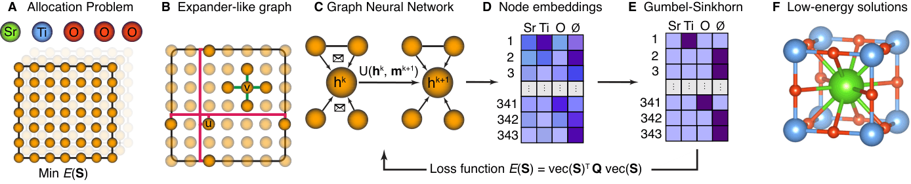

# Crystal Structure Prediction using Graph Neural Combinatorial Optimization

This repository provides the implementation of [GNT-CSP], a neural combinatorial approach for crystal structure prediction. 



Crystal structure prediction (CSP) seeks a minimum energy allocation of atoms to a uniform grid of points within a given unit cell. Two types of constraints are always present in this setting: (a) no two atoms are allowed to
occupy the same position; (b) the desired stoichiometry dictates the number of atoms and their species. Our GNT-CSP
approach inherently encodes both CSP constraints, eliminating the need for explicit penalty terms, and finds high-quality feasible structures without relying on any solutions precomputed by a solver. Starting from a grid of points that discretizes the unit cell and defines potential atomic positions, we construct a 3D graph based on the Gabber-Galil graph. We then train a GNN to compute node representations that are projected into the feasible solution space and sample high-quality solutions minimizing the total interaction energy. 

[GNT-CSP]: https://arxiv.org/abs/2604.23921

## Installation

Start by creating a new conda environment.
```bash
conda create -n gnt-csp python=3.9
conda activate gnt-csp
```

Install PyTorch with CUDA. 
```bash
pip install torch==2.4.0 torchvision torchaudio --index-url https://download.pytorch.org/whl/cu118
```

Install remaining requirements (among which are PyTorch-geometric and pymatgen) as included in `requirements.txt`.
```bash
pip install -r requirements.txt
```

## Running experiments

To run an experiment using GNT-CSP, do:

```bash
python main.py --instance SrTiO3G8 --multiple 1 --graph-type Gabber-Galil --seed 0
```

It will perform the structure search of SrTiO<sub>3</sub> with a discretization parameter `g=8` and `multiple=1`, whose pairwise interaction energies and stoichiometry are defined in file in `instances/SrTiO3G8_1.lp`.

### parameter explanation for GNT-CSP
`--instance` refers to the composition for which we solve the combinatorial CSP (default is SrTiO<sub>3</sub>).\
`--multiple` controls how many times the unit cell is repeated in each dimension (default is 1).\
`--graph-type` refers to the graph construction used for message-passing, options are Gabber-Galil (default), Margulis and Cutoff. \
`--seed` is used for reproducibility purposes.

The `.lp` files of the compositions that we investigated in the paper can be found in `instances/`. The repo of [Integer Programming for crystal structure prediction][ipcsp] provides code to create additional `.lp` files of various compositions with different parameters (such as grid size and unit cell size) as well as a [Gurobi][gurobi] solver for CSP.

[ipcsp]: https://github.com/lrcfmd/ipcsp
[gurobi]: https://www.gurobi.com/


## Baselines
We also provide appropriate implementations of two classical heuristic approaches, namely a bespoke Greedy solver and Simulated Annealing, that can be used to solve the combinatorial CSP in `baselines.py`. To run the Greedy solver for the same instance as above, run:

```bash
python baselines.py --instance SrTiO3G8 --multiple 1 --method Greedy --num-seeds 10 --num-steps 1000
```

## Citation
This research code is written to accompany the paper: <br>
```bibtex
@misc{gerolymatos2026crystalstructurepredictionusing,
      title={Crystal structure prediction using graph neural combinatorial optimization}, 
      author={Stavros Gerolymatos and J. Kyle Brubaker and Martin J. A. Schuetz and Vladimir V. Gusev},
      year={2026},
      eprint={2604.23921},
      archivePrefix={arXiv},
      primaryClass={cs.LG},
      url={https://arxiv.org/abs/2604.23921}, 
}